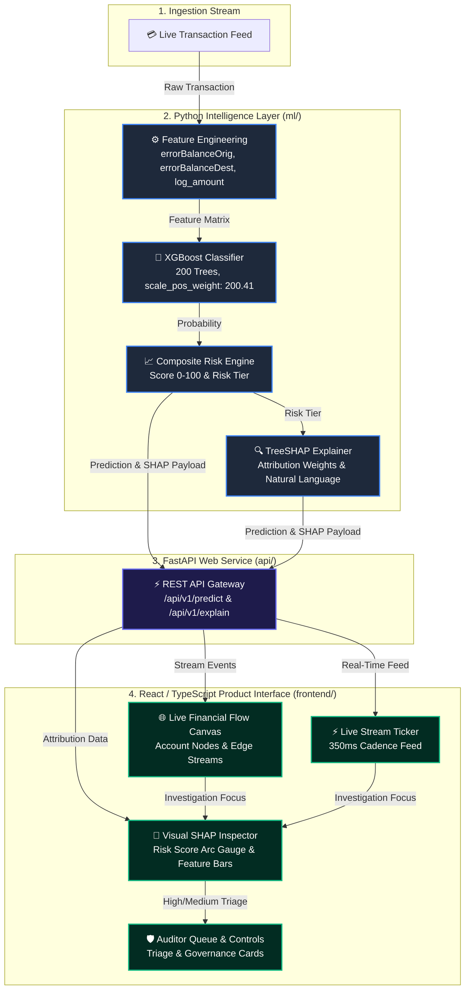

# FLOWARE

> **Explainable Financial Risk Intelligence Layer & Real-Time Investigation Platform**  
> *EFOS Global Finance Hackathon 2026 — Track 02 (Audit & Risk), Case 1: Suspicious Transaction Detection*

---

## 📌 Overview

**FLOWARE** is an explainable financial risk intelligence layer that combines a **Python-based Machine Learning pipeline** with a **real-time React/TypeScript investigation interface**.

Legacy fraud detection systems suffer from either high false-positive rates (85–95%) or unexplainable black-box ML predictions. FLOWARE addresses this by pairing an optimized **XGBoost gradient boosting classifier** with **TreeSHAP feature attribution** to deliver natural-language, auditor-ready explanation strings alongside real-time financial flow graph visualizations.

---

## 🏗️ End-to-End System Architecture



---

## 📁 Repository Structure

```
floware/
├── ml/                       # Python ML Pipeline
│   ├── data_loader.py        # PaySim dataset loader & schema validation
│   ├── feature_engineering.py# Balance error features (errorBalanceOrig, errorBalanceDest) & log transforms
│   ├── train_model.py        # XGBoost model training (200 trees, scale_pos_weight tuning)
│   ├── predict.py            # FraudPredictor inference & risk score engine
│   ├── explain.py            # TreeSHAP feature attribution & natural language generation
│   ├── risk_scoring.py       # Composite risk scoring engine
│   ├── evaluate.py           # Benchmark metrics evaluation
│   └── requirements.txt      # Python ML dependencies
│
├── api/                      # FastAPI Service Layer
│   ├── main.py               # REST API endpoints (/predict, /explain, /metadata)
│   ├── prediction_service.py # Service wrapper
│   └── requirements.txt      # API dependencies
│
├── models/                   # Serialized ML Artifacts
│   ├── xgboost_model.json    # Trained XGBoost model weights
│   └── model_metadata.json   # Hyperparameters & validation metrics
│
├── docs/                     # Technical Documentation
│   ├── architecture.md       # Full architecture & ASCII data flow
│   ├── ml_pipeline.md        # Feature formulas & TreeSHAP mathematics
│   └── methodology.md       # Risk tiering & audit compliance controls
│
├── data/                     # Dataset Samples
│   └── sample_transactions.csv
│
├── frontend/                 # React + TypeScript Investigation UI
│   ├── src/                  # Financial Flow Canvas, Stream Ticker, SHAP Inspector
│   ├── public/               # Static data & assets
│   ├── package.json          # Frontend dependencies
│   ├── tsconfig.json
│   └── vite.config.ts
│
├── README.md                 # Project Overview & Setup Guide
└── requirements.txt          # Top-Level Python Dependencies
```

---

## 📊 Pre-Trained Model & Dataset Benchmark

The ML intelligence layer is trained on **1.11M+ PaySim synthetic financial transactions** with severe class imbalance:

| Parameter | Metric Value |
| :--- | :--- |
| **Dataset** | PaySim Synthetic Financial Transactions |
| **Training Records** | 1,119,136 transactions |
| **Validation Subset** | 223,828 transactions |
| **Algorithm** | XGBoost (`binary:logistic`) |
| **Ensemble Trees** | 200 trees (`n_estimators: 200`) |
| **Class Imbalance Ratio** | `scale_pos_weight: 200.418442` |
| **Precision** | **0.72** |
| **Recall** | **0.82** |
| **F1 Score** | **0.77** |
| **PR-AUC** | **0.87** |
| **ROC-AUC** | **0.94** |

---

## 💻 Quick Start Guide

### 1. Python ML & API Setup

```bash
# Clone the repository
git clone https://github.com/shinchxn/floware.git
cd floware

# Install Python dependencies
pip install -r requirements.txt

# Test ML predictor self-check
python ml/predict.py

# Test TreeSHAP explainer self-check
python ml/explain.py

# Launch FastAPI backend service
uvicorn api.main:app --reload --port 8000
```
FastAPI interactive Swagger documentation will be available at `http://localhost:8000/docs`.

---

### 2. React / TypeScript Frontend Setup

```bash
# Navigate to frontend directory
cd frontend

# Install Node dependencies
npm install

# Start Vite local dev server
npm run dev
```
The investigation interface will launch at `http://localhost:3000/`.

---

## 📄 License & Hackathon Submission

Built for the **EFOS Global Finance Hackathon 2026 (Track 02: Audit & Risk, Case 1)**.

Created by Team **FLOWARE**.
