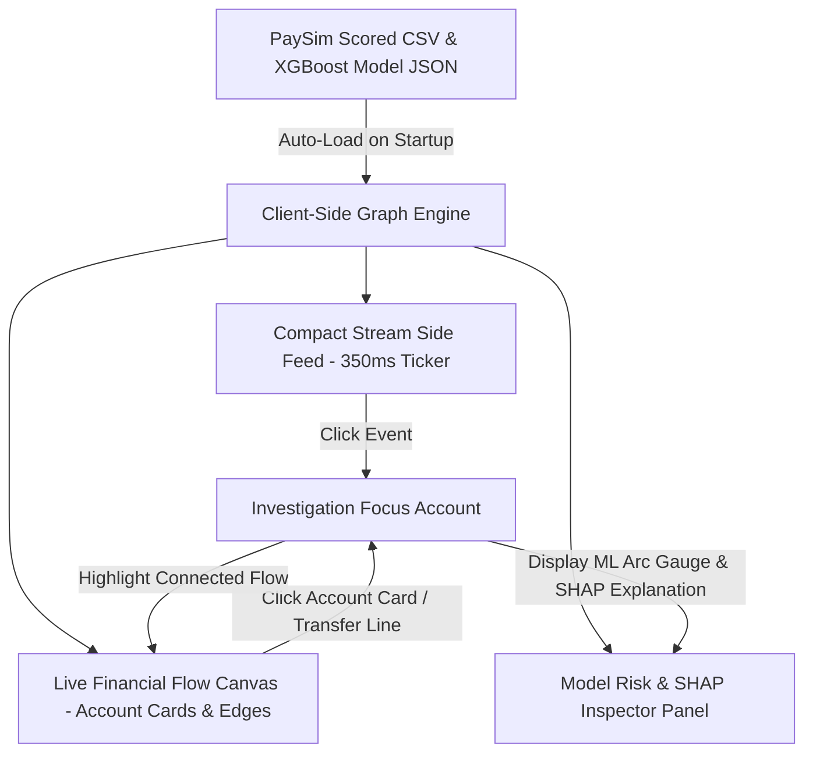

# FLOWARE

> **Real-Time Financial Transaction Ecosystem Monitoring & Explainable Fraud Detection Platform**  
> *EFOS Global Finance Hackathon 2026 — Track 02 (Audit & Risk), Case 1: Suspicious Transaction Detection*

---

## 📌 Overview

**FLOWARE** is a production-grade, client-side fintech platform that monitors financial transaction streams in real time, visualizes account ecosystem money movement, and delivers human-readable SHAP explanations for every flagged transaction.

Existing fraud detection models achieve high classification accuracy but suffer from black-box unexplainability, while legacy rule engines generate **85–95% false positives**. **FLOWARE** bridges this gap by pairing real ML classification accuracy with instant, natural-language feature attribution for audit and risk compliance.

---

## ✨ Key Platform Features

### 1. 🌐 Live Financial Flow Canvas (Main Viewport)
- **Permanent Account Cards**: Renders account nodes (`ACC ••••8392`) displaying account category, total IN volume (`₹45,000`), total OUT volume (`₹35,000`), and risk tier badges (`NORMAL`, `MEDIUM`, `HIGH RISK`).
- **Directional Money Movement Streams**: Visualizes real-time money movement between Source → Target → Downstream accounts with directional transfer arrows, amounts (`₹12,000`), and timestamps (`10:42 AM`).
- **Glowing ML Risk Aura**: Suspicious accounts identified by the ML model ignite with a pulsing coral-red risk aura (`pulse-red-aura`) and warning indicator badges.

### 2. ⚡ Autonomous Stream Ticker (350ms Cadence)
- **Continuous Live Feed**: Streams dataset transactions autonomously every 350ms (~3 transactions/sec) into the feed without requiring manual play/pause video controls.
- **Side Feed**: Real-time transaction list (`10:42:01 ACC1024 → ACC8392 ₹8,500`) prepending new entries dynamically.

### 3. 🎯 ML Model Interception & Auto-Focus
- **Instant Risk Interception**: When an incoming transaction is scored as high risk (`predicted_probability > 0.70`), FLOWARE locks Investigation Focus onto that account and triggers a live alert: **"🚨 LIVE ML INTERCEPTION DETECTED"**.

### 4. 🔍 Visual SHAP Inspector Panel
- **XGBoost Risk Score Arc Gauge**: SVG semi-circle arc meter showing exact model confidence percentage.
- **Visual Feature Impact Bars**: Color-coded progress meters displaying feature contribution weights (`Transfer Type: +38%`, `Origin Balance Error: +34%`, `Log Amount: +18%`).
- **Natural Language SHAP Explanation**: Renders the exact feature attribution text produced by the model (e.g. *"Flagged primarily because the transaction was a direct transfer and account balances did not update consistently with transaction amount..."*).

### 5. 🛡️ Auditor Review Queue & Institutional Governance Controls
- **Auditor Queue**: Filtered view of MEDIUM and HIGH risk transactions ordered by risk score descending, including `actual_isFraud` validation comparison tooltips.
- **Recommended Controls**: 5 icon-fronted governance cards (Dual authorization, hard velocity limits, monthly retraining pipelines, human-in-the-loop review, and immutable audit logging).

---

## 📊 Pre-Trained Model & Dataset Metrics

| Parameter | Value |
| :--- | :--- |
| **Dataset** | PaySim Synthetic Financial Transactions |
| **Training Records** | 1,119,136 transactions |
| **Validation Subset** | 223,828 transactions |
| **Model Algorithm** | XGBoost (`binary:logistic`) |
| **Ensemble Trees** | 200 trees (`num_trees: 200`) |
| **Class Imbalance Weight** | `scale_pos_weight: 200.418442` |
| **Precision** | **0.72** |
| **Recall** | **0.82** |
| **F1 Score** | **0.77** |
| **PR-AUC** | **0.87** |

---

## 🏗️ Architecture & Tech Stack



- **Frontend**: React 18, TypeScript, Vite
- **Styling**: Vanilla CSS (Custom Design Tokens, CSS Keyframes Motion System)
- **Data Engine**: PapaParse (Chunked client-side CSV streaming)
- **Icons**: Lucide React

---

## 💻 Quick Start & Local Setup

### Prerequisites
- Node.js `v18.0.0+`
- npm `v9.0.0+`

### Installation

```bash
# 1. Clone the repository
git clone https://github.com/shinchxn/floware.git
cd floware

# 2. Install dependencies
npm install

# 3. Start the local development server
npm run dev
```

The application will launch locally at `http://localhost:3000/` (or next available port).

---

## 📄 License & Hackathon Submission

This project is built for the **EFOS Global Finance Hackathon 2026 (Track 02: Audit & Risk, Case 1)** submission.

Created by Team **FLOWARE**.
