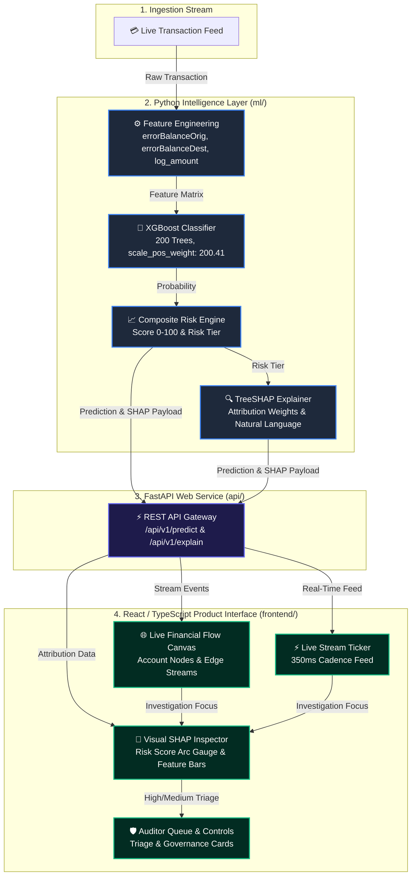

# FLOWARE System Architecture

> **Real-Time Financial Transaction Ecosystem Monitoring & Explainable Fraud Detection**  
> *EFOS Global Finance Hackathon 2026 — Track 02 (Audit & Risk)*

---

## 🏗️ High-Level System Architecture

---

## 🧩 Component Subsystems

### 1. Python ML Engine (`ml/`)
- **Data Ingestion (`data_loader.py`)**: Loads and validates PaySim financial transactions schema.
- **Feature Engineering (`feature_engineering.py`)**: Computes balance error features (`errorBalanceOrig`, `errorBalanceDest`), log transaction amounts, and identity indicators.
- **XGBoost Classifier (`train_model.py`)**: 200 trees binary classifier tuned with `scale_pos_weight: 200.4184` for severe class imbalance.
- **TreeSHAP Explainer (`explain.py`)**: Computes exact feature contribution weights and generates human-readable attribution text.

### 2. FastAPI Web Service (`api/`)
- **REST Endpoints**:
  - `POST /api/v1/predict`: Real-time transaction scoring.
  - `POST /api/v1/explain`: TreeSHAP attribution and natural language explanations.
  - `GET /model/metadata`: Model hyperparameters and validation benchmarks.

### 3. React / TypeScript Frontend (`frontend/`)
- **Live Financial Flow Canvas**: Permanent Account Nodes & directional money transfer edges.
- **Visual SHAP Inspector**: Arc gauge risk score meter and color-coded feature attribution bars.
- **Auditor Triage Queue**: High and medium risk case review tools.
